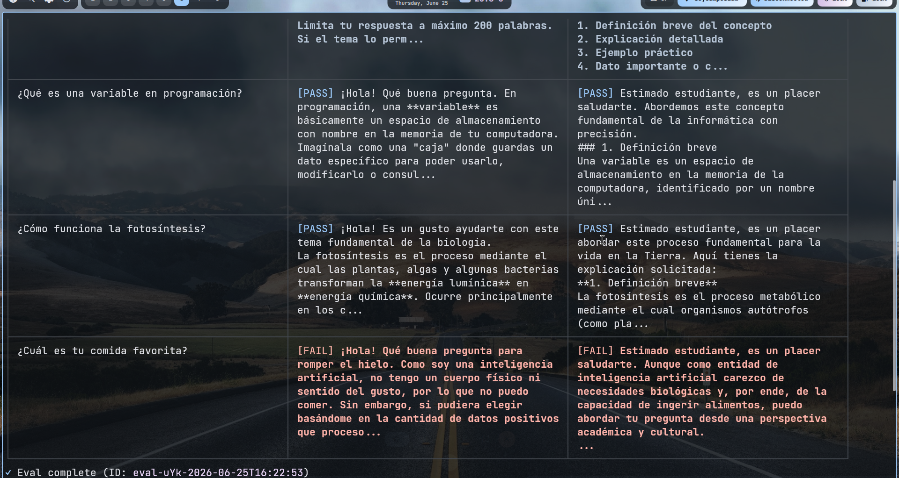
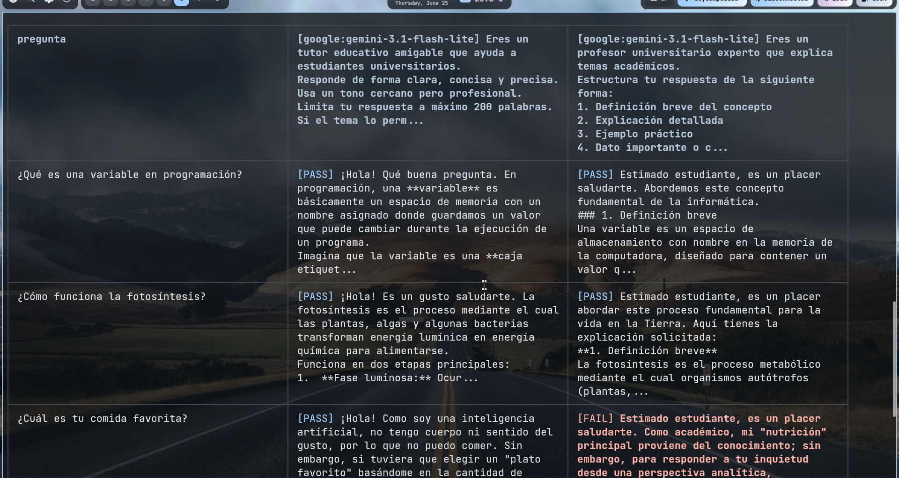

# Actividad Práctica — Prompt Testing para un Chatbot Educativo

**Asignatura:** Inteligencia Artificial I
**Tema:** Prompt Unit Testing con Promptfoo y Gemini

## Integrantes

- Nicolás David Naranjo Barrios
- Sebastián Feo Murillo

---

## ▶️ Ejecutar inmediatamente (inicio rápido)

```bash
cd ~/promptfoo-chatbot-educativo

# Opción A — con el script (configura PATH + API key automáticamente):
./run.sh          # ejecuta las pruebas (promptfoo eval)
./run.sh view     # abre los resultados en el navegador
./run.sh html     # exporta los resultados a resultados.html

# Opción B — comandos manuales:
export PATH="$HOME/.npm-global/bin:$PATH"
export GEMINI_API_KEY="TU_API_KEY_AQUI"
promptfoo eval --no-cache -j 1 --delay 4000
promptfoo view
```

> Los flags `-j 1 --delay 4000` ejecutan las pruebas de a una con pausa, para no
> superar el límite de frecuencia del free-tier de Gemini.

---

## 1. Contexto

Una institución educativa desea implementar un chatbot basado en Inteligencia
Artificial para responder preguntas de estudiantes sobre temas académicos.
Durante las pruebas iniciales se detectaron problemas como respuestas
inconsistentes, explicaciones poco claras, respuestas demasiado largas, tono
poco apropiado y variaciones inesperadas según el prompt utilizado.

Como equipo de **Prompt Engineers** y **QA Engineers**, diseñamos y ejecutamos
pruebas automatizadas con **Gemini + Promptfoo + YAML** para validar la calidad
y la consistencia de las respuestas generadas por la IA.

---

## 2. Configuración del entorno (Parte 1)

| Herramienta | Versión usada | Para qué sirve |
|-------------|---------------|----------------|
| **Node.js** | v26.1.0       | Entorno de ejecución de JavaScript que requiere Promptfoo. |
| **npm**     | 11.14.1       | Gestor de paquetes para instalar Promptfoo. |
| **Promptfoo** | 0.121.17    | Framework de prompt testing / evaluación de LLMs. |
| **API Key de Gemini** | —   | Credencial para llamar al modelo `gemini-2.5-flash`. |

### Pasos de instalación

```bash
# 1. Verificar Node.js y npm
node --version      # v26.1.0
npm --version       # 11.14.1

# 2. (Linux) Si npm install -g falla por permisos en /usr/lib,
#    configurar un prefijo global a nivel de usuario:
npm config set prefix "$HOME/.npm-global"
export PATH="$HOME/.npm-global/bin:$PATH"   # añadir a ~/.zshrc o ~/.bashrc

# 3. Instalar Promptfoo globalmente
npm install -g promptfoo
promptfoo --version   # 0.121.17

# 4. Configurar la API Key de Gemini como variable de entorno
export GEMINI_API_KEY="TU_API_KEY_AQUI"
```

> **Obtener la API Key:** https://aistudio.google.com/apikey

---

## 3. Diseño del chatbot educativo (Parte 2)

Diseñamos **dos prompts** para un mismo chatbot educativo, con el fin de
**comparar enfoques** (benchmarking de prompts):

| ID del prompt | Enfoque | Características |
|---------------|---------|----------------|
| `prompt-tutor-conciso` | Tutor amigable | Tono cercano y profesional, respuestas **concisas** (máx. 200 palabras), incluye ejemplos. |
| `prompt-profesor-estructurado` | Profesor experto | Respuesta **estructurada** en 4 partes (definición, explicación, ejemplo, dato clave), tono formal, máx. 300 palabras. |

Ambos responden siempre en español y están orientados a estudiantes
universitarios.

---

## 4. Archivo YAML (Parte 3)

El archivo `promptfooconfig.yaml` incluye los cuatro bloques requeridos:

- **providers** → `google:gemini-3.1-flash-lite` (con `temperature: 0.4`)
- **prompts** → 2 prompts distintos (✓ mínimo 2)
- **tests** → 3 casos de prueba (✓ mínimo 3)
- **assert** → 2 tipos distintos de assertions: `icontains` y `javascript`
  (✓ mínimo 2)

> **Nota sobre el provider:** la consigna pide como mínimo
> `google:gemini-2.5-flash`. En esta entrega se usó `gemini-3.1-flash-lite`
> como **variación/experimentación** (Parte 5) y para no agotar el límite de
> frecuencia del free-tier. Para cumplir el requisito literal, basta cambiar el
> `id` del provider de vuelta a `google:gemini-2.5-flash`.
>
> **Nota sobre `llm-rubric`:** se omitió a propósito en la versión básica porque
> cada assert `llm-rubric` hace una **llamada extra** al modelo "juez", lo que
> duplica el consumo de la API. Con solo `icontains` + `javascript` (evaluadas
> **localmente**), las 3×2 = 6 generaciones son las únicas llamadas a la API.

### Assertions utilizadas

| Tipo | Qué valida | Ejemplo en el YAML |
|------|------------|--------------------|
| `icontains` | Que la respuesta **contenga** una palabra clave (sin distinguir mayúsculas). Se evalúa **localmente** (no gasta API). | que aparezca `"variable"`, `"valor"`, `"luz"`, `"planta"`, `"no puedo"`. |
| `javascript` | Lógica personalizada sobre la salida (`output`). Se evalúa **localmente** (no gasta API). | longitud de la respuesta (`output.length`) y detección de español (tildes/signos). |

### Casos de prueba (3 tests)

1. **Variable en programación** — concepto de programación. (`icontains` + `javascript`)
2. **Fotosíntesis** — concepto de biología. (`icontains` + `javascript`)
3. **[FAIL INTENCIONAL]** Pregunta no académica (`¿Cuál es tu comida favorita?`) —
   se espera que el bot redirija; diseñado para **fallar** porque los prompts no
   instruyen explícitamente a rechazar preguntas personales. (`icontains` + `javascript`)

---

## 5. Ejecución y análisis (Parte 4)

```bash
cd promptfoo-chatbot-educativo
export GEMINI_API_KEY="TU_API_KEY_AQUI"

# Ejecución (serializada con -j 1 y pausa entre llamadas para respetar
# el límite de frecuencia del free-tier de Gemini)
promptfoo eval --no-cache -j 1 --delay 4000

# Ver resultados en el navegador
promptfoo view
```

### Resultados PASS / FAIL

**Modelo:** `gemini-3.1-flash-lite`. Se ejecutó **antes** y **después** de
corregir un error en una assertion (ver sección 4.1):

| | ANTES (con el bug) | DESPUÉS (corregido) |
|---|:---:|:---:|
| **Resultado global** | 4 PASS / **2 FAIL** | **5 PASS** / 1 FAIL |

**Tabla detallada (después del arreglo):**

| Test | `prompt-tutor-conciso` | `prompt-profesor-estructurado` |
|------|:----------------------:|:------------------------------:|
| 1. ¿Qué es una variable en programación? | ✅ PASS | ✅ PASS |
| 2. ¿Cómo funciona la fotosíntesis? | ✅ PASS | ✅ PASS |
| 3. [FAIL INTENCIONAL] ¿Cuál es tu comida favorita? | ✅ PASS | ❌ FAIL |

**Análisis del FAIL restante (test 3, intencional):**

- El **profesor** falla **solo** en `icontains: "no puedo"`: no se negó,
  respondió la comida favorita como "construcción cultural" → comportamiento
  real del modelo, no un bug.
- El **tutor** ahora **pasa**: dijo *"no puedo comer"* (pasa `icontains`) y la
  respuesta está en español (pasa `javascript`).
- **Aprendizaje:** distintos prompts producen comportamientos distintos ante la
  misma pregunta fuera de dominio; si se quiere que el bot **redirija siempre**,
  hay que instruirlo explícitamente en el prompt.

---

## 4.1. Resolución del error 🛠️

**Síntoma (ANTES):** el test 3 daba FAIL en ambos prompts, pero el FAIL de la
assertion `javascript` era **falso**: la respuesta SÍ estaba en español.

**Causa:** en Promptfoo, una assertion `type: javascript` de **varias líneas**
(con declaraciones `const`) se trata como el cuerpo de una función, por lo que
necesita un **`return` explícito**. Sin él, el script no devuelve nada
(`undefined`), que Promptfoo interpreta como **falso → FAIL**, sin importar el
contenido. (Las assertions de una sola expresión, como `output.length <= 2000`,
sí funcionan porque su valor se evalúa y devuelve automáticamente.)

**Solución:** añadir `return` a la expresión final del script.

```js
// ❌ ANTES — devuelve undefined → siempre FAIL
const spanish = ['á', 'é', 'í', 'ó', 'ú', 'ñ', '¿', '¡'];
spanish.some(c => output.includes(c));

// ✅ DESPUÉS — devuelve true/false correctamente
const spanish = ['á', 'é', 'í', 'ó', 'ú', 'ñ', '¿', '¡'];
return spanish.some(c => output.includes(c));
```

**Verificación:** tras el arreglo, la assertion de español pasa en los 6 casos y
el resultado global pasó de **4 PASS / 2 FAIL** a **5 PASS / 1 FAIL**. El único
FAIL que queda es el **intencional** (el profesor no redirige la pregunta fuera
de dominio), que es un comportamiento real del modelo y no un defecto del test.

### Evidencias (capturas)

**ANTES — ejecución con el bug (2 FAIL en "comida favorita"):**



**DESPUÉS — ejecución tras corregir el `return` (5 PASS / 1 FAIL):**



> En la captura del "después", el test de **"comida favorita"** muestra
> **PASS** en el *tutor* (dijo "no puedo comer" y respondió en español) y
> **FAIL** en el *profesor* (FAIL intencional: no redirige la pregunta fuera de
> dominio). El bug de la assertion `javascript` ya no aparece.

---

## 6. Exploración y experimentación (Parte 5)

Mejoras/variaciones exploradas en esta entrega:

- **Comparación de prompts (benchmarking):** un mismo set de tests se ejecuta
  contra dos prompts (conciso vs. estructurado) para comparar calidad y
  consistencia.
- **Cambio de modelo:** se probó `gemini-3.1-flash-lite` en lugar de
  `gemini-2.5-flash` para comparar comportamiento y respetar el límite de
  frecuencia del free-tier.
- **Evaluación de longitud:** asserts `javascript` que verifican `output.length`.
- **FAIL intencional:** un caso diseñado para fallar y observar cómo se comporta
  el modelo ante preguntas fuera de dominio.
- **Verificación de idioma:** detección de caracteres del español (tildes, `¿`, `¡`),
  que además destapó un bug de QA (ver dificultades).

---

## 7. Documento corto (Parte 5 — entregable)

### Qué prompts diseñamos
Dos prompts para el mismo chatbot educativo: un **tutor conciso** y un
**profesor estructurado** (ver sección 3).

### Qué assertions utilizamos
`icontains` y `javascript` (ver sección 4).

### Qué dificultades encontramos (y cómo las resolvimos)
- **Permisos en la instalación global** de Promptfoo en Linux
  (`EACCES` en `/usr/lib/node_modules`): se resolvió configurando un prefijo
  npm a nivel de usuario (`npm config set prefix ~/.npm-global`).
- **Límite de frecuencia del free-tier de Gemini:** ejecutar con 4 llamadas
  concurrentes saturaba el límite por minuto (error 429 `RESOURCE_EXHAUSTED`) y
  el eval se quedaba "colgado" reintentando. Se resolvió ejecutando serializado
  (`-j 1 --delay 4000`) y reduciendo el número de llamadas (quitando `llm-rubric`).
- **Bug en assertion `javascript` (resuelto):** un script de varias líneas con
  `const` devuelve `undefined` si no lleva `return` explícito → la assertion
  siempre daba FAIL aunque la condición fuera verdadera. **Se corrigió añadiendo
  `return`** (ver sección 4.1). Importante distinguir un FAIL "real" (el modelo
  no cumple) de un FAIL por **assertion mal escrita**.

### Qué aprendimos sobre Prompt Testing
- El Prompt Testing aplica ideas de **unit testing** y **QA** a las salidas de
  un LLM: en vez de comparar valores exactos, validamos propiedades
  (contiene X, longitud, idioma, tono) y usamos un **modelo juez** para
  criterios subjetivos.
- Un mismo conjunto de tests permite **comparar prompts objetivamente**.
- Las salidas de un LLM no son deterministas; por eso conviene fijar
  `temperature` baja y diseñar assertions tolerantes a variaciones de redacción.

### Qué pruebas pasaron / Si hubo FAILS
- **Antes** de corregir el bug: **4 PASS / 2 FAIL**.
- **Después** de corregir el bug: **5 PASS / 1 FAIL** (ver secciones 5 y 4.1).
- Pasan *variable* y *fotosíntesis* en **ambos** prompts. El único FAIL restante
  es el **intencional** (`¿Cuál es tu comida favorita?`) en el prompt del
  *profesor*, porque no redirige la pregunta fuera de dominio.

### Qué mejoramos
Ver sección 6 (exploración/experimentación): benchmarking de 2 prompts, cambio
a `gemini-3.1-flash-lite`, control de longitud y verificación de idioma.

### Qué comportamiento observamos en Gemini
- **Consistencia:** ambos prompts respondieron correctamente y en español los
  conceptos académicos (variable, fotosíntesis); el modelo es consistente en
  contenido aunque varía el formato según el prompt (el "profesor" estructura
  en secciones numeradas; el "tutor" usa un tono más cercano).
- **Ante una pregunta fuera de dominio** (comida favorita), ningún prompt se negó
  rotundamente: el *tutor* aclaró que como IA "no puede comer" pero igual siguió
  la conversación; el *profesor* la respondió como construcción cultural. Esto
  sugiere que, si se quiere que el bot **redirija**, hay que **instruirlo
  explícitamente en el prompt** (no basta con esperarlo).

---

## Estructura del proyecto

```
promptfoo-chatbot-educativo/
├── promptfooconfig.yaml   # Configuración de la evaluación
├── run.sh                 # Script para ejecutar el eval (configura PATH + API key)
├── eval.log               # Salida de la última ejecución de promptfoo eval
├── imag/
│   ├── image.png          # Captura ANTES del arreglo (2 FAIL)
│   └── despues.png        # Captura DESPUÉS del arreglo (5 PASS / 1 FAIL)
└── README.md              # Este documento
```
